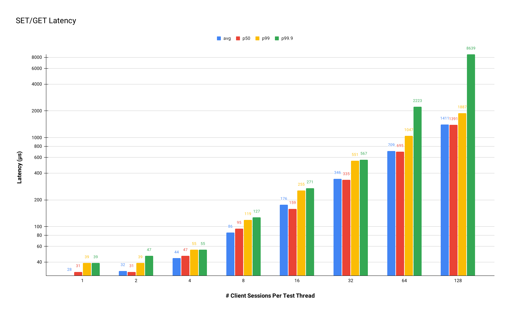

# Benchmarks

## Test Setup

Due to hardware limitations, the benchmarks are conducted with rdss and the test tool co-located on the same node, utilizing the following setup:

- CPU: 16-core AMD Ryzen 9 3950X (-MT MCP-) speed/min/max: 3499/2200/4761 MHz
- Mem: 64214.6 MiB
- Host: ubuntu
- Kernel: 6.5.0-26-generic x86_64

For rdss, the default configuration is applied unless otherwise specified, with the exception that the number of client executors is set to 13.

## GET Throughput

This benchmark is inspired by Garnet's methodology. Prior to executing the actual workload, we preload a small database (1024 keys) and a large database (256M keys) into rdss, a small data size is used(8-byte values). The workload involves quering keys with uniform distribution via GET commands, and we measure the throughput across various numbers of client sessions.

<details>
<summary>Commands used:</summary>

- Fill the small DB with 1024 consecutive keys starting at 1024:

    ```memtier_benchmark --hide-histogram -t 1 -c 1 -D --key-minimum=1024 --key-pattern=S:S --ratio=1:0 -d 8 -n 1024```

- Query the small DB using 18 threads and uniform distribution with `$C` clients per thread:

    ```T=18 && taskset -c $((32-$T))-31 memtier_benchmark --hide-histogram -t $T --key-minimum=1024 --key-maximum=2048 --key-pattern=R:R --ratio=0:1 --distinct-client-seed --test-time=30 -c $C```

- Fill the large DB with 256M keys (memtier_benchmark used is modified to allow a 'key-maximum' of 256'000'000):

    ```memtier_benchmark --hide-histogram -t 16 -c 16 --key-pattern=P:P --ratio=1:0 -d 8 -n 1000000```

- Query the large DB using 18 threads and uniform distribution with `$C` clients per thread:

    ```T=18 && taskset -c $((32-$T))-31 memtier_benchmark --hide-histogram -t $T --key-pattern=R:R --ratio=0:1 --distinct-client-seed --test-time=30 -c $C```

</details>


For a small DB size, the GET throughput peaks at around 1M ops/sec with 64 clients per test thread. However, for the larger database size, the throughput is approximately 20% lower.

## SET/Mixed Throughput

Pure Set and Mixed (20% SET, 80% GET) workloads are evaluated using different data size {8, 128, 2048}.

<details>
<summary>Commands used:</summary>

- SET

    ```T=18 && taskset -c $((32-$T))-31 memtier_benchmark --hide-histogram -t $T --key-pattern=R:R --ratio=1:0 --distinct-client-seed --test-time=30 -c 32 -d $DATASIZE```

- Mixed

    ```T=18 && taskset -c $((32-$T))-31 memtier_benchmark --hide-histogram -t $T --key-pattern=R:R --ratio=2:8 --distinct-client-seed --test-time=30 -c 32 -d $DATASIZE```

</details>


We observe a significant performance gap between SET operations and GET and Mixed workloads, indicating that the hash table's write performance, particularly as it scales, serves as the primary bottleneck. Additionally, the throughput decreases as the data size grows, aligning with our expectations.

## SET/GET Latency

A mixed workload (20% SET, 80% GET) is employed to evaluate latency.



We observe that latency rises with an increase in the number of client sessions per thread. However, it appears to be more influenced by the test program rather than the workload itself. For instance, latency with 10 test threads, each with 13 clients, resembles latency with a single test thread and 13 clients, but is noticeably lower than latency with a single test thread and 128 clients.

## Scalability

This benchmark assesses throughput scalability. We configure a small database similar to the one used in the GET Throughput benchmark and vary the number of rdss I/O threads to measure the GET throughput.


We can observe that when the number of threads is no larger than 6, each thread achieves around 100K ops/sec. However, this figure begins to decline from 8 threads onwards. With 12 threads, the throughput decreases to 84K ops/sec per thread. This decline is due to contention for the service executor ring's completion queue lock when I/O threads transfer coroutine execution to the service thread, resulting in increased CPU time wastage.

## Summary

- In smaller GET workloads, rdss achieves approximately 1M ops/sec with 13 I/O threads. However, this throughput diminishes as the keyspace expands.
- SET performance notably lags behind GET, highlighting the hash table's write performance as the primary bottleneck.
- Each I/O thread maintains around 100K ops/sec until reaching 8 threads, after which throughput decreases to 85K ops/sec with 12 threads. This decline is attributed to contention at the service executor's completion queue lock.